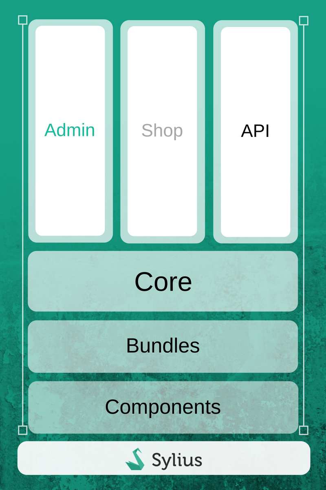

.. index::
   single: Architecture

结构概览
=====================

在我们分别学习每个Sylius概念之前，您需要先了解我们的主应用的结构。
您已经知道Sylius是基于Symfony组件和包构建的，它们是框架的集成层(integration layers).

所有包遵循相同的事物命名和数据持久化的约定。 默认情况下，Sylius使用Doctrine ORM来管理所有实体。

要深入学习Doctrine是如何工作的, 请参阅 `官方文档 <http://doctrine-orm.readthedocs.org/en/latest/>`_.

全栈 Symfony
-----------------

.. image:: ../../_images/symfonyfs.png
    :scale: 15%
    :align: center

**Sylius** 基于Symfony，它是构建Web应用程序的领先PHP框架。
通过Symfony框架，开发人员可以更好更快的开发完全适配业务规则、结构化、易维护和易升级的应用。
同时，它还允许通过使用通用的可重用模块来节省开发时间。

`深入学习 Symfony <http://symfony.com/what-is-symfony>`_.

Doctrine
--------

**Doctrine** 是一个专门提供数据持久层的PHP库系列。
最重要的是对象关系映射器（ORM）和数据库抽象层（DBAL）。
Doctrine的主要特点之一是可以在Doctrine查询语言（DQL）中编写数据库查询，这是SQL的面向对象写法。

`深入学习 Doctrine <http://www.doctrine-project.org/about.html>`_.

Twig
----

.. image:: ../../_images/twig.png
    :scale: 30%
    :align: center

**Twig** 是PHP的现代模板引擎，真正的快速，安全和灵活。 Symfony正在使用Twig。

`深入学习 Twig <http://twig.sensiolabs.org/>`_.

架构
------------

在下图中，您可以看到Sylius架构的象征性表示

|

继续阅读本章，了解有关其各个部分的更多信息：商城(Shop)，后台(Admin)，API，核心(Core)，组件(Components)和软件包(Bundles)。

深入学习组件、包和平台
-------------------------------------------

组件(Components)
~~~~~~~~~~~~~~~~~~

Sylius的每一个组件都可以独立使用。
以``税收(Taxation)``组件为例，它唯一的责任是计算税收，不管是针对产品还是其他任何东西，这是完全解耦的。
您只需要让自己的类继承 ``TaxableInterface``，便可以让税收组件来计算税务部分。
这种方式对于Sylius的每个组件都是正确的。
除了与电子商务需求严格相关的组件，我们还有更多的其他组件。
例如 属性(Attribute)，邮件(Mailer)，地区(Locale) 等

所有的组件在 `Packagist <https://packagist.org/>`_ 上都是可用的.

:doc:`深入学习组件 </components_and_bundles/components/index>`.

包(Bundles)
~~~~~~~~~~~~~~

这些是Symfony软件包 - 因此，如果您是Symfony开发人员，并且您想在系统中使用Taxation组件，但是您不想花时间在容器中配置表单或服务。
您可以在应用程序中包含 ``TaxationBundle`` , 可以使用最少的或者甚至无需任何配置即可以访问所有服务，模型，税率配置，税收类别，并应用于任何你需要的税收。

:doc:`深入学习包 </components_and_bundles/bundles/index>`.

平台(Platform)
~~~~~~~~~~~~~~~~

这是一个基于Symfony标准版本的全栈Symfony应用程序。
Sylius平台为您提供了经典且功能丰富的网上商店。
在开始使用Sylius之前，您需要确定是否需要一个完整的平台，使用我们提供的所有功能；
也可能会使用解耦的包和组件来构建一些完全定制化的东西，可能更轻巧，具有不同的特性。
当然，Sylius平台本身是非常灵活的，可以轻松地进行定制，以满足您可能面临的所有业务需求。

.. _division-into-core-shop-admin-api:

深入学习核心, 后台, 商城和Api
------------------------------------

核心(Core)
~~~~~~~~~~~

核心是集成所有其他组件的另一个组件。
例如 ``ProductVariant`` 拥有 ``TaxCategory`` 属性, 就是在这里实现的。
``ProductVariant`` 继承 ``TaxableInterface`` 和其他一些需要的接口，都应该在Core组件中实现。
Core组件是“ProductVariant”实现“TaxableInterface”和其他对其操作有用的接口。
Sylius在这里继承了要运行一个商城所需要的一切概念。
要了解更多在Sylius应用的概念 - 继续阅读 :doc:`The Book </book/index>` 。

后台(Admin)
~~~~~~~~~~~~~

在具有安全层的每个系统中，系统管理的功能需要仅对管理员 - 某些具有一定角色的用户开放。
这就是我们的 ``AdminBundle`` 的职责，如果你不需要它，可以关闭它。
视图已经使用 `SemanticUI <http://semantic-ui.com/>`_ 构建好了。

商城(Shop)
~~~~~~~~~~~~~~

我们的 ``ShopBundle`` 是一套标准的B2C接口。
它主要由yaml配置和模板组成。
同样也是使用 `SemanticUI <http://semantic-ui.com/>`_ 来构建的视图。

Api
~~~~

我们的API使用的REST方式。
Since our controllers are format agnostic they have become reusable in the API.（译者注：翻译不了~）
因此，如果您在商城前端页面请求产品，可能与后端使用api请求时使用的是相同的action。
:doc:`深入学习 API </api/index>`.

第三方库
---------------------

为实现不同的任务，Sylius使用了很多第三方库:

* `Payum <https://github.com/Payum/Payum>`_ - 支付
* `KnpMenu <http://symfony.com/doc/current/bundles/KnpMenuBundle/index.html>`_ - 商城和后台菜单
* `Gaufrette <https://github.com/KnpLabs/Gaufrette>`_ - 文件系统抽象（本地镜像存储，Amazon S3或外部服务器）
* `Imagine <https://github.com/liip/LiipImagineBundle>`_ - 图像处理，生成缩略图和剪切
* `Pagerfanta <https://github.com/whiteoctober/Pagerfanta>`_ - 分页处理
* `Winzou State Machine <https://github.com/winzou/StateMachineBundle>`_ - 状态机处理
