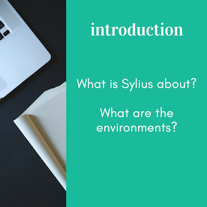

Sylius 文档
====================

.. image:: /_images/logo.png
   :alt:   Sylius Welcome Page

`Sylius`_ 是一个基于 `Symfony Framework`_ 搭建的现代化电子商务PHP解决方案.

.. note::

    本篇文档假设你有一定的 Symfony Framework 使用经验. 如果你还不熟悉 Symfony,
    请先阅读 Symfony 官方文档中的 `Quick Tour`_ .

.. tip::

   **The Book, 定制指南, REST API 参考, Cookbook, 贡献指南和 `Behat` 指南**
   是描述基于 Sylius-Standard 版本的 **全栈Sylius平台** 使用方法的章节.

   针对仅使用Sylius部分组件的开发者，请参见 Bundles and Components 文档.

The Book
--------

针对开发者如何灵活使用Sylius的一份指南. 你可以在这里找到Sylius平台使用到的所有概念.
:doc:`The Book </book/index>` 帮助你理解Sylius是如何工作的.

|

.. toctree::
   :hidden:

   book/index

|

定制指南
-----------------------

:doc:`定制指南 </customization/index>` 对于需要适配Sylius到你自己的业务中是很有帮助的.

.. toctree::
   :hidden:

   customization/index

.. include:: /customization/map.rst.inc

Sylius 插件
--------------

Sylius插件的集合及其开发指南. 记住，你可以在插件中使用 :doc:`定制化指南 </customization/index>` 提及的所有技术.

.. toctree::
   :hidden:

   plugins/index

.. include:: /plugins/map.rst.inc

The Cookbook
------------

:doc:`The Cookbook </cookbook/index>` 是一些针对特殊需求的特殊解决方案.

.. toctree::
   :hidden:

   cookbook/index

.. include:: /cookbook/map.rst.inc

REST API 参考
----------------------

:doc:`API 指南 </api/index>` 覆盖了 Sylius 平台的 REST API.

.. toctree::
   :hidden:

   api/index

.. include:: /api/map.rst.inc

行为驱动开发(BDD)指南
-------------------------------

在 :doc:`BDD 指南 </bdd/index>` 中，你会学习到如何利用 Behat 编写清晰、可重用的特性、上下文和页面.

.. toctree::
   :hidden:

   bdd/index

.. include:: /bdd/map.rst.inc

贡献指南
----------------------

对 Sylius 的 :doc:`贡献指南 </contributing/index>`.

.. toctree::
   :hidden:

   contributing/index

.. include:: /contributing/map.rst.inc

支持
-------

Sylius 的 :doc:`支持 </support/index>` 部分.

.. toctree::
   :hidden:

   support/index

.. include:: /support/map.rst.inc

组件
--------------------

:doc:`Sylius 所有组件相关的文档 </components_and_bundles/index>` 对于需要单独使用这些组件是很有帮助的。

.. toctree::
   :hidden:

   components_and_bundles/index

.. include:: /components_and_bundles/map.rst.inc

.. _Sylius: http://sylius.org
.. _`Symfony Framework`: http://symfony.com
.. _`Quick Tour`: http://symfony.com/doc/current/quick_tour
.. _`Introduction`: http://docs.sylius.org/en/latest/book/introduction/index.html
.. _`Installation`: http://docs.sylius.org/en/latest/book/installation/index.html
.. _`Architecture`: http://docs.sylius.org/en/latest/book/architecture/index.html
.. _`Configuration`: http://docs.sylius.org/en/latest/book/configuration/index.html
.. _`Customers`: http://docs.sylius.org/en/latest/book/customers/index.html
.. _`Products`: http://docs.sylius.org/en/latest/book/products/index.html
.. _`Carts & Orders`: http://docs.sylius.org/en/latest/book/orders/index.html
.. _`Themes`: http://docs.sylius.org/en/latest/book/themes/index.html
